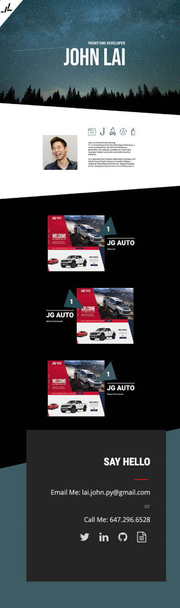

# John Lai's Portfolio

# User Story
* As an employer I want to view a potential employee's deployed portfolio of work samples so that I can review samples of their work and assess whether they're a good candidate for an open position

# Description
* This is John Lai a Full Stack Developer's portfolio site.
* Using Scss instead of css, files are in the scss folder inside the partials folder, which gets imported in to style.scss. The style scss file complies into a min.css inside the css folder under assets.

* I will be adding bootstrap and javascript in a later version.

# Screenshot

# Live Site
* https://johnxlai.github.io/my-portfolio/